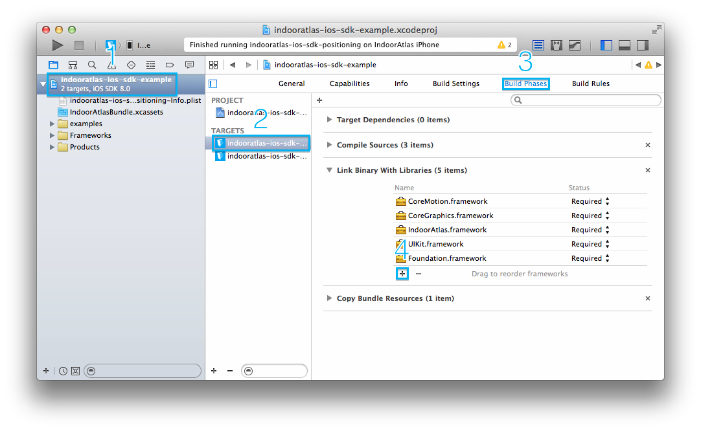
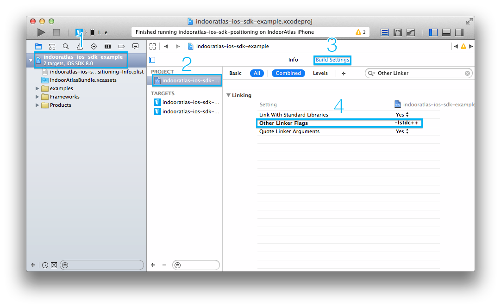
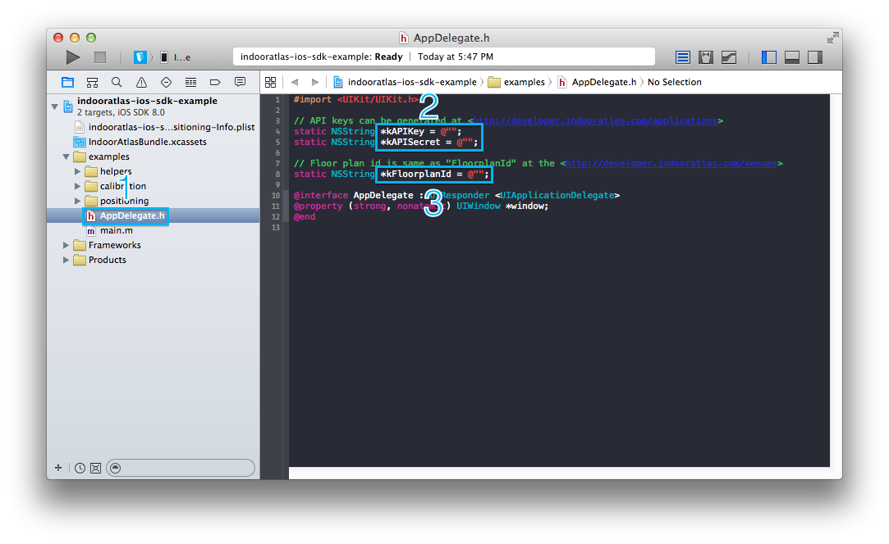
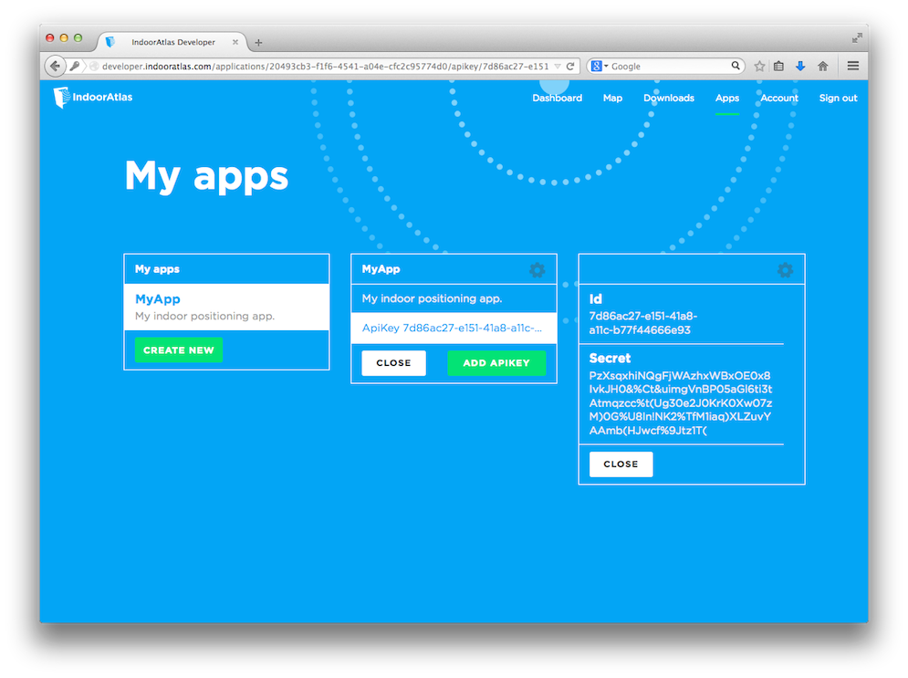
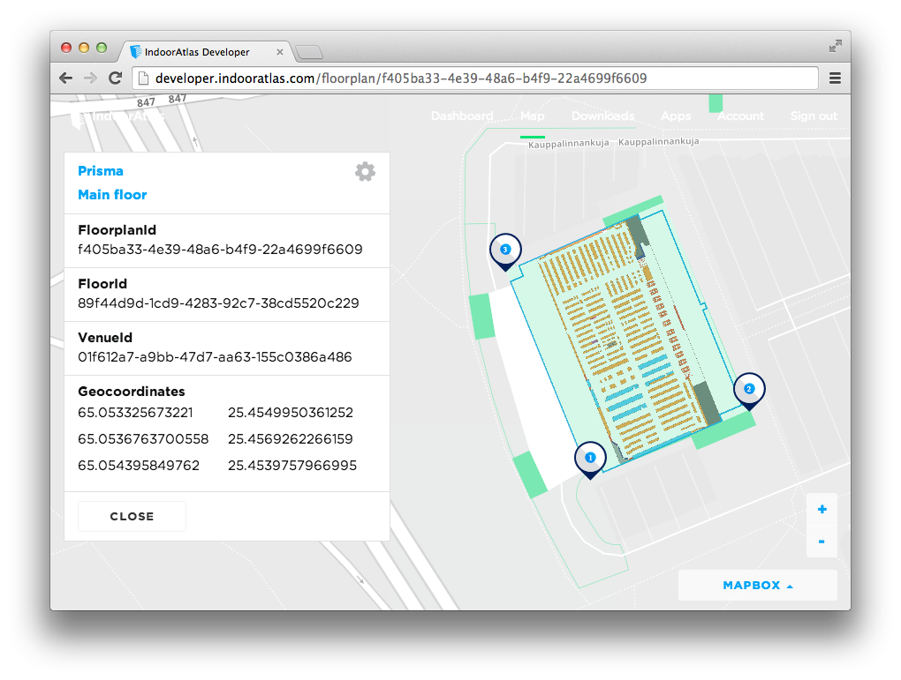

## Adding IndoorAtlas framework to your project

1. Select the **project file** from the project navigator on the left side of the project window.
2. Select the **target** for where you want to add IndoorAtlas framework in the project settings editor.
3. Select the **Build Phases** tab, and click the small triangle next to **Link Binary With Libraries** to view all of the frameworks in your application.
4. To add IndoorAtlas framework, click the **"+"** below the list of frameworks.
5. Click **Add Other...** and select the **IndoorAtlas.framework** from your extracted SDK package.
6. You will also need the **CoreMotion** and **Foundation** frameworks, as well **libz.dylib** and **libicucore.dylib**.

Alternatively you can drag and drop the framework to your project file structure.
Make sure you enable **Copy Items to Destination**.

## Configuring your project

The SDK uses some C++ functionality internally, and thus needs to be linked with C++ standard library.

1. Select the **project file** from the project navigator on the left side of the project window.
2. Select the **project** or **target** linking against IndoorAtlas framework in the project settings editor.
3. Select the **Build Settings** tab.
4. Search for **Other Linker Flags** and add **-lstdc++** there.

## Compiling the IndoorAtlas SDK example project

The Xcode project contains targets for positioning and calibration examples.

1. Select **AppDelegate.h** from the project navigator on the left side of the project window.
2. Set **kAPIKey** and **kAPISecret** to your API key and secret.
3. Set **kFloorplanId** to your floor plan ID.

## How to obtain API key and secret

Generate API keys at [IndoorAtlas developer, Apps](http://developer.indooratlas.com/applications).

## How to get floor plan ID

Get floor plan ID from [IndoorAtlas developer, Map](http://developer.indooratlas.com/venues).

1. Select building.
2. Select floor plan.
3. Copy **FloorplanId**.

