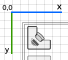
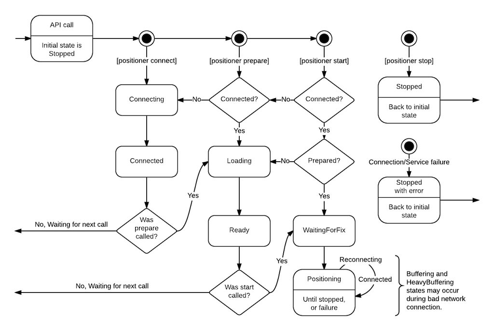

# Positioning

Indoor positioning functionality is provided through <IndoorAtlasPositioner> class.

## Instancing positioner

Positioner instances can be requested for floor plan instances from class method <[IndoorAtlas positionerForFloorplan:]>.

```
[IndoorAtlas setApiKey:@"api-key" andSecret:@"api-secret"];

[IndoorAtlas fetchFloorplanWithId:@"id-of-the-floor-plan" completion:^(IndoorAtlasFloorplan *floorplan, NSError *error) {
    if (error)
        return;

    IndoorAtlasPositioner *positioner;
    positioner = [IndoorAtlas positionerForFloorplan:floorplan];
}];
```

## Starting positioner

Each positioner is bound to one floor plan.

Positioners may be **connected**, **prepared**, **started**, and **stopped** manually. These methods trigger state changes through a delegate.

```
// Connect to positioning service, do nothing else.
[positioner connect];

// Tell service to prepare the positioning session.
// This will automatically call connect, if not called before.
[positioner prepare];

// Session may also be prepared with parameters
IndoorAtlasPositionerParameters *params = [IndoorAtlasPositionerParameters new];

// For example, set shopping cart motion mode
// params.motionMode = @"shopping_cart";

[positioner prepareWithParameters:params]

// Start positioning
// This will call prepare automatically, if not called before.
[positioner start];

// You may also start with parameters.
// These parameters are same as for prepare, and ignore if prepare or prepareWithParameters: is called before.
// Only use this method, if you don't explicitly have need to prepare session before.
[positioner startWithParameters:params];

// Disconnect from service.
[positioner stop];
```

## Going background

iOS will keep reading sensors when application is in background state during positioning.
This helps SDK to find location faster when application enters foreground.

If you do not need positioning during background state, it is recommended to stop positioning before to save battery.

## Explicit position

Set explicit position using the <IndoorAtlasPositioner> instance.
Setting explicit position causes started positioner instances to converge at the given location.
Connected but not yet started positioner instances will use the given location as a starting position.

Explicit position allows you to utilize external position data, for example beacons, with IndoorAtlas indoor positioning technology.

```
// Submits explicit metric position (x: 7.5, y: 14.6) from the upper left corner of the floor plan with radius of 3 meters
[positioner submitExplicitMetricPosition:(IndoorAtlasPoint){ 7.5, 14.6 } withRadius:3.0];

// Submits explicit pixel position (x: 320 y: 120) with radius of 25 pixels
[positioner submitExplicitPixelPosition:(IndoorAtlasPixel){ 320, 120 } withRadius:25];
```

## Position updates

Implement the <IndoorAtlasPositionerDelegate> to get events from the positioner.

Position updates are received through <[IndoorAtlasPositionerDelegate indoorAtlasPositioner:positionChanged:]> method.
The <IndoorAtlasPosition> instance received by this method contains the WGS84, metric and pixel coordinates, course information and uncertainty radius.

```
- (void)indoorAtlasPositioner:(IndoorAtlasPositioner*)positioner positionChanged:(IndoorAtlasPosition*)position
{
    // Latency is only calculated during positioning
    NSLog(@"Latency: %.2f", positioner.latency);
    NSLog(@"Position pixel point: %dx%d", position.pixelPoint.x, position.pixelPoint.y);
    NSLog(@"Position metric point: %f, %f", position.metricPoint.x, position.metricPoint.y);
    NSLog(@"Position coordinate (lat: %f lon: %f)", position.coordinate.latitude, position.coordinate.longitude);
    NSLog(@"Uncertainty radius (%f meters)", position.radius);
    NSLog(@"Course (%f)", position.course);
}
```



Metric and pixel coordinates in <IndoorAtlasPosition> instance are from top left to bottom right.
This means the (0, 0) would be the top left of the floor plan image.

## Switching floor plans

Use multiple <IndoorAtlasPositioner> instances to switch between floor plans.

```
// Create 2 positioner instances for both floor plans
IndoorAtlasPositioner *positioner1 = [IndoorAtlas positionerForFloorplan:@"floor-plan-id-1"];
IndoorAtlasPositioner *positioner2 = [IndoorAtlas positionerForFloorplan:@"floor-plan-id-2"];

/ Start first positioner instance
[positioner1 start];

// When switching floor plan, stop the running instance and start the another
[positioner1 stop];
[positioner2 start];

// Switch back to the first positioner
[positioner2 stop];
[positioner1 start];
```

## State changes

Positioner state changes emit <[IndoorAtlasPositionerDelegate indoorAtlasPositioner:stateChanged:]> method.
State changes indicate the state of session and possible connection problems.

```
- (void)indoorAtlasPositioner:(IndoorAtlasPositioner*)positioner stateChanged:(IndoorAtlasPositioningState)state
{
    switch (state) {
        default:
            // See the constants and documentation in IndoorAtlasPositioner.h
            // Also check the state diagram below.
            NSLog(@"State changed");
            break;
    }
}
```

The state diagram below outlines the state changes:



